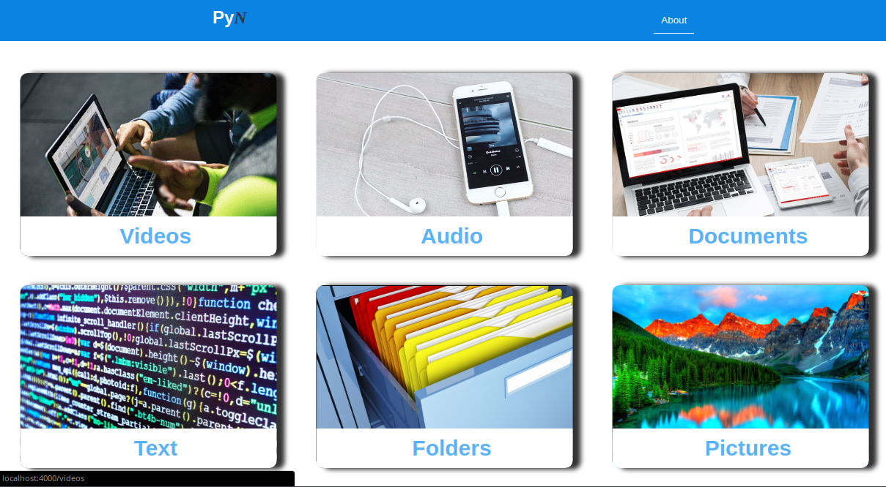
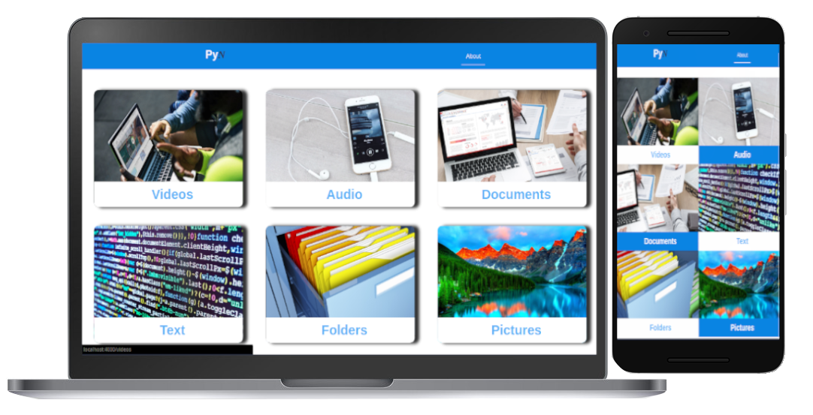
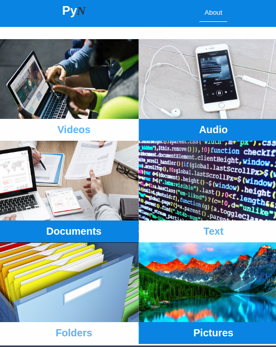
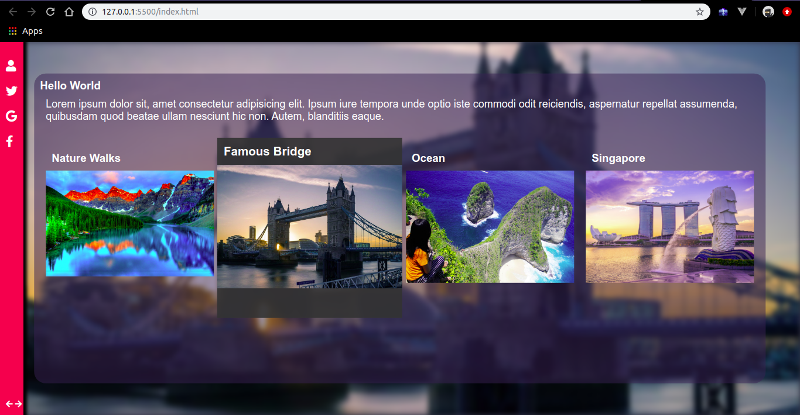
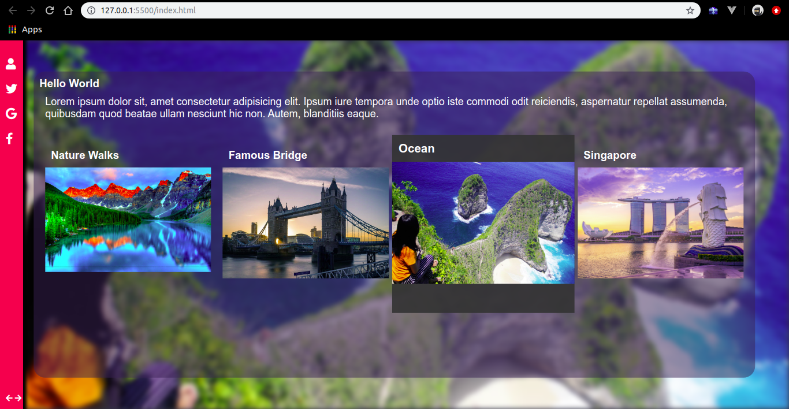
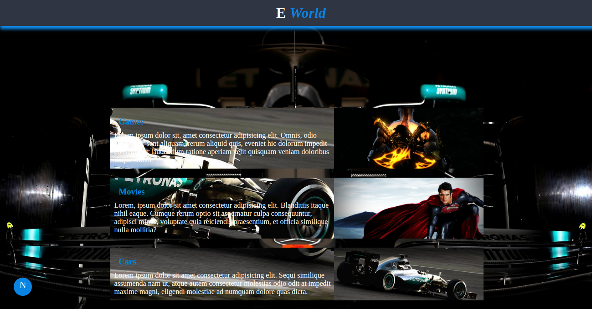
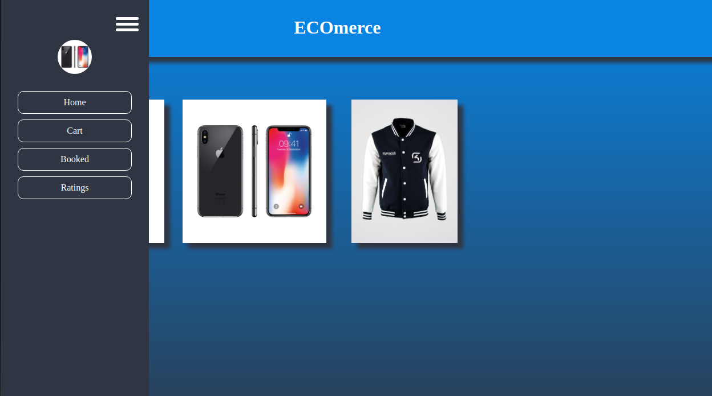
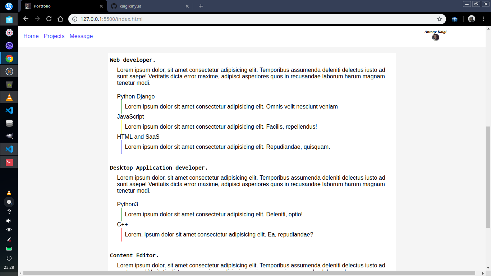
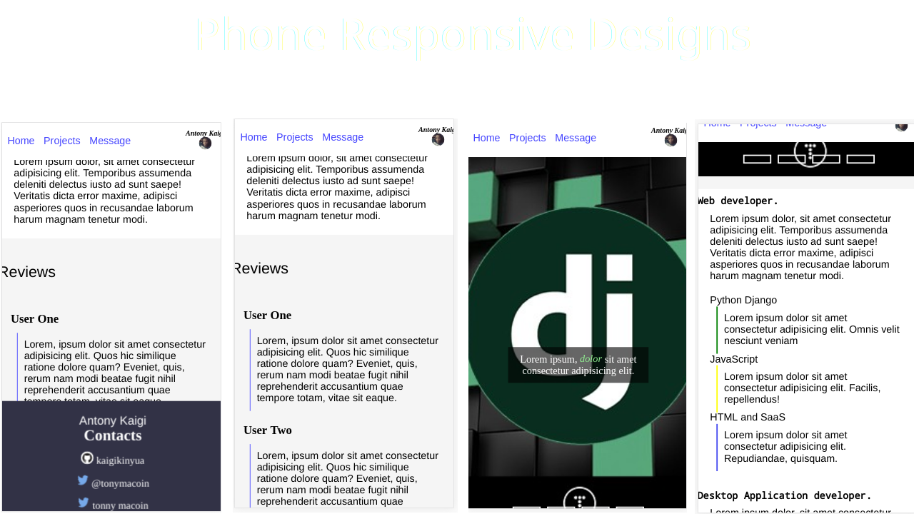

# Ui/Ux

# HTML & CSS implementations

## Pyn

My project on a file sharing application. UI designs for both the desktop app and the web UI.

## Destination picker 

A simple traveller application ui landing page.

# Asure
Asure Design Files
Training on azure UI designs and some implementations
E_World
A site that enables you to connect to other people with similar hobboies

User Interface Design for an ecomerce site

User Interface Designs for a Portfolio
Desktop View

# Responsive Designs

